# <div align="center">zMailR · 24 小时临时邮箱服务</div>

<div align="center">
  <p><strong>Enhanced fork of <a href="https://github.com/zaunist/zmail">zaunist/zmail</a></strong>（MIT License）</p>

  <p>
    <a href="https://zmailr.itool.eu.cc/" target="_blank"><strong>在线体验</strong></a>
    ·
    <a href="./README.en.md">English</a>
  </p>
</div>

---

## 项目简介

**zMailR** 是基于 Cloudflare Workers + D1 部署的**开源、可自托管**临时邮箱服务。用户可在 Web 界面一键生成 24 小时有效地址并实时收信；开发者通过 Bearer Token 完成「租用邮箱 → 长轮询收信 → 提取验证码 → 可选 Brevo 发信」。定位类似 [MailSink](https://mailsink.dev/docs/) 的收信与 OTP 自动化，但以自托管与出站发信为差异化。

**技术栈**：Cloudflare Workers、D1、Email Routing（入站）、Brevo Transactional API（出站）、React + Vite 前端。

**在线演示**：[https://zmailr.itool.eu.cc/](https://zmailr.itool.eu.cc/) · 演示账号 `guest` / `guest`

---

## 功能亮点

- **Web 控制台**：临时邮箱、收件箱/发件箱、验证码高亮（OtpBox）、明暗主题、简体中文界面
- **程序化 API**：`lease` / `mail` / `send` scope 的 Bearer Token，长轮询收信与 OTP 提取
- **提取规则**：系统内置 + 用户自定义，按发件人域名匹配正则
- **管理后台**：用户治理、公告、限流监控、维护模式、审计日志（路径由 `ADMIN_PATH` 配置）
- **GitHub Actions**：推送 `main` 自动部署至 Cloudflare Workers

完整 API 列表与限流说明见部署后的 [`/api-docs`](https://zmailr.itool.eu.cc/api-docs) 或 [user-auth.md](docs/user-auth.md)。

---

## 效果图

### 登录

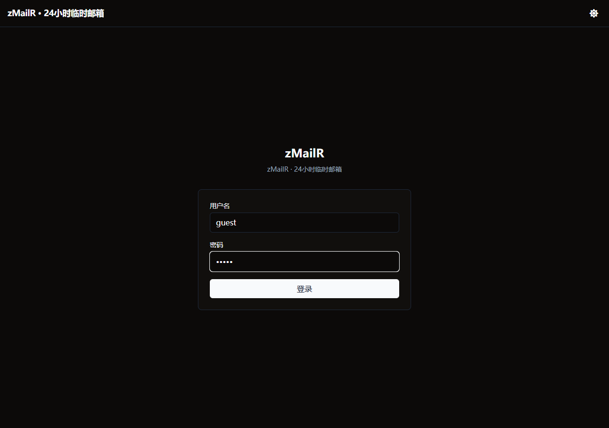

### 仪表板

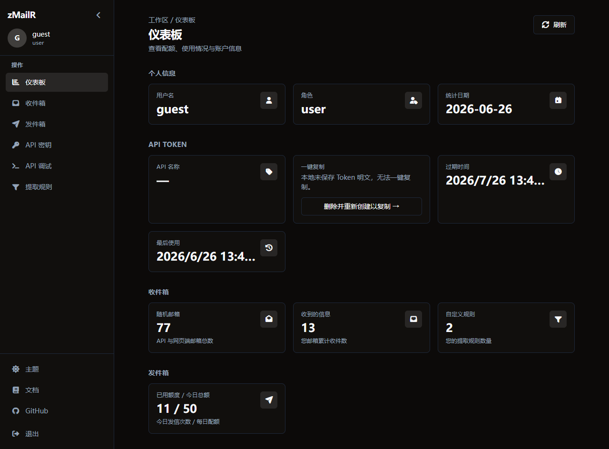

展示 API Token 状态、收件/发件用量与今日发信配额。

### 收件箱

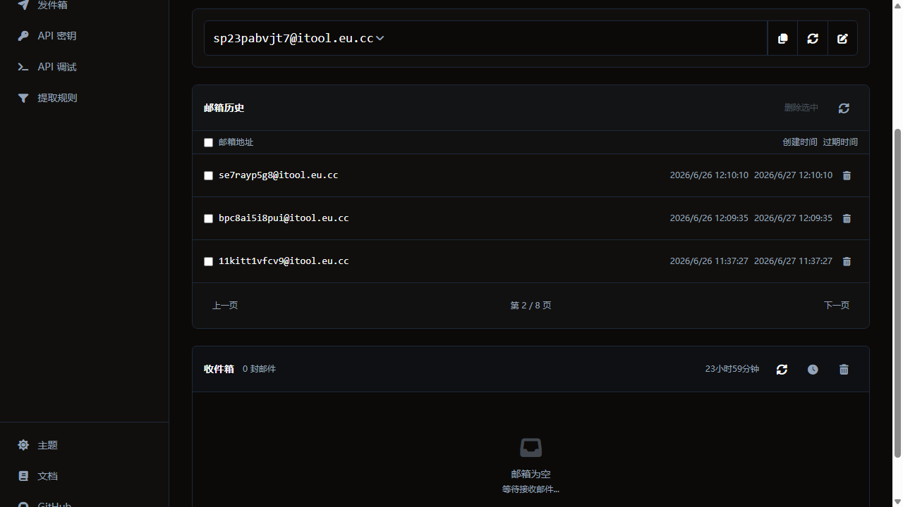

新建 24 小时临时地址，实时收信，验证码自动提取并在 OTP 列高亮。

### 发件箱

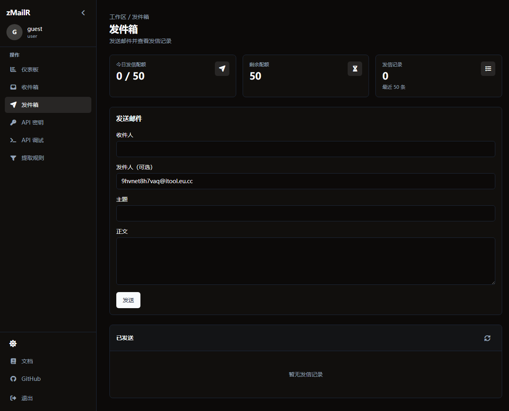

填写收件人/主题/正文发送事务邮件，查看今日配额与发信记录。

### API 密钥

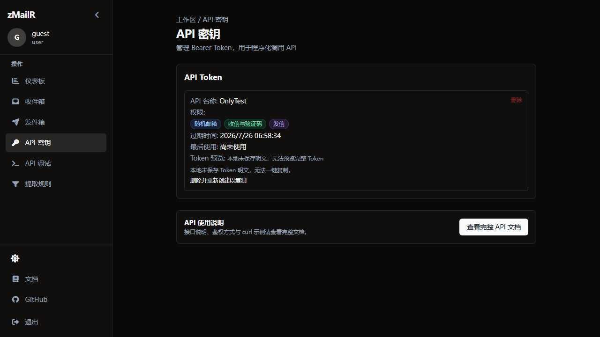

每位用户限 1 个 Bearer Token，可选 `lease` / `mail` / `send` scope，含 curl 示例。

### API 调试

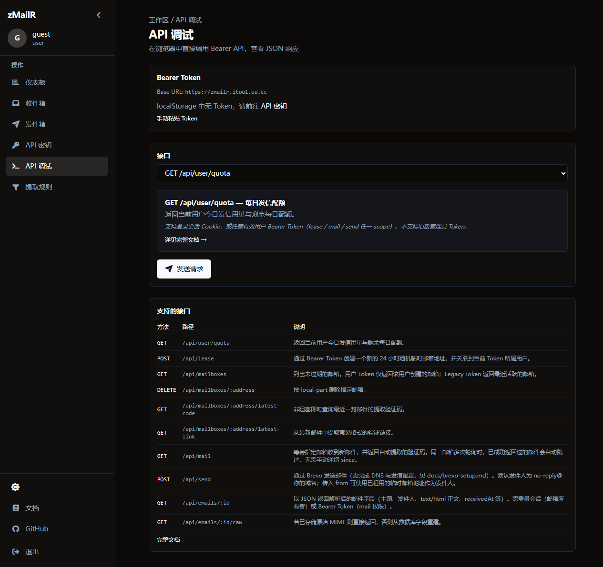

浏览器内直接调用 Bearer API，查看 JSON 响应与速率限制头。

### 提取规则

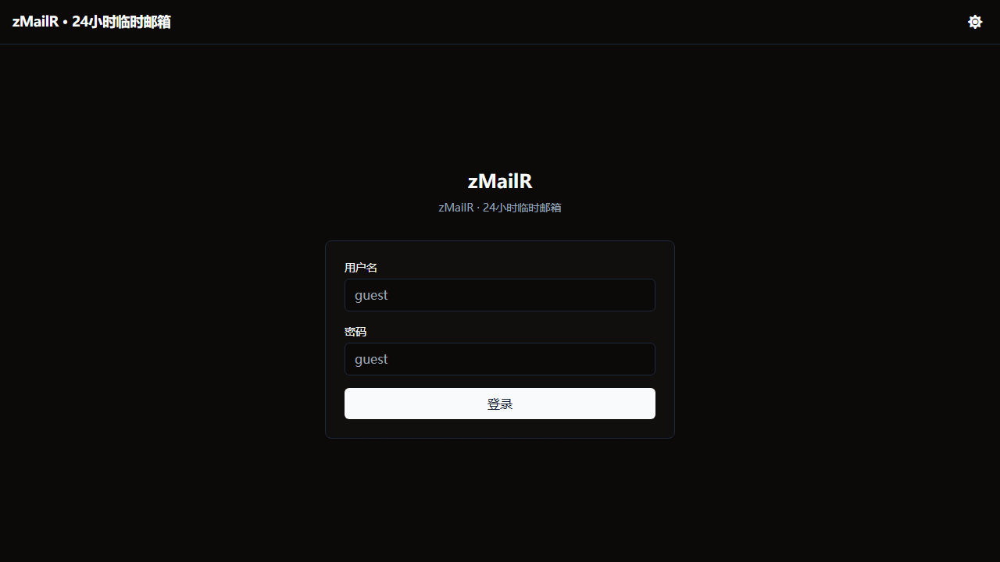

系统内置规则（只读）与用户自定义规则（按域名优先级匹配）。

### 管理后台

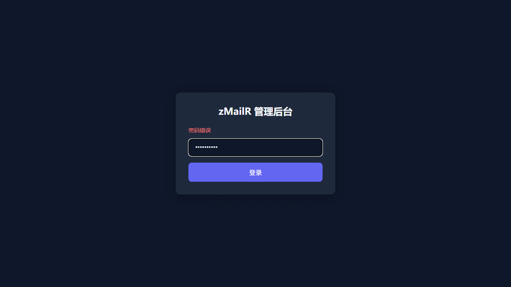

管理后台 URL 为 `https://你的域名/{ADMIN_PATH}`，需配置 `ADMIN_PASSWORD` 登录。详见 [admin-guide.md](docs/admin-guide.md)。

#### 仪表盘

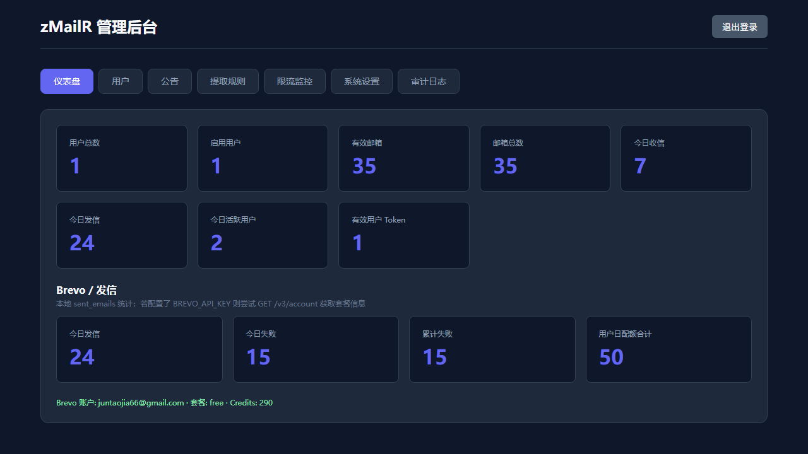

用户/邮箱/收发信统计与 Brevo 套餐信息。

#### 用户管理

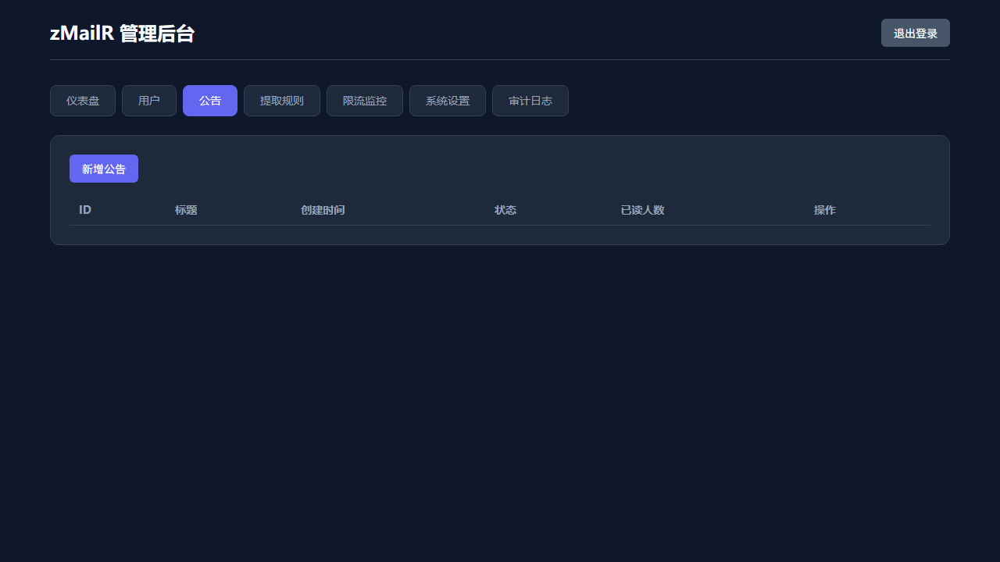

创建/编辑用户、日发信配额与速率方案（Free / Pro / Team）。

#### 公告

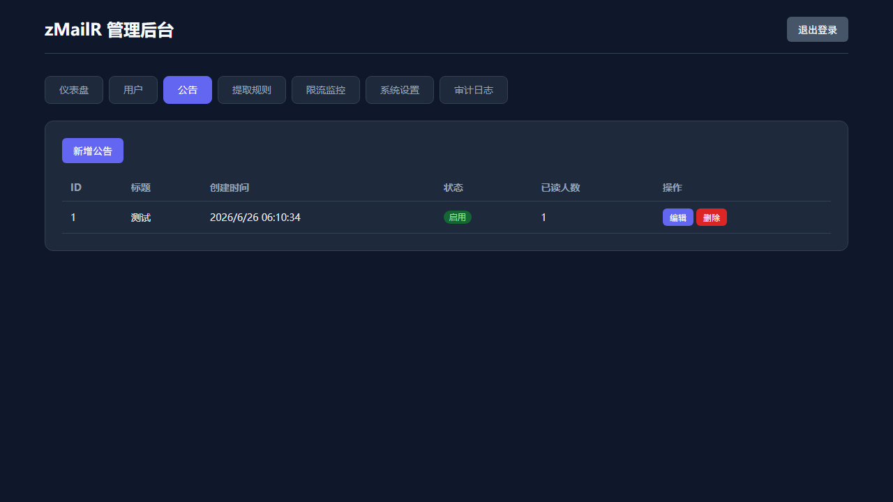

面向 Dashboard 用户的系统公告（Markdown/纯文本）。

#### 提取规则（管理）

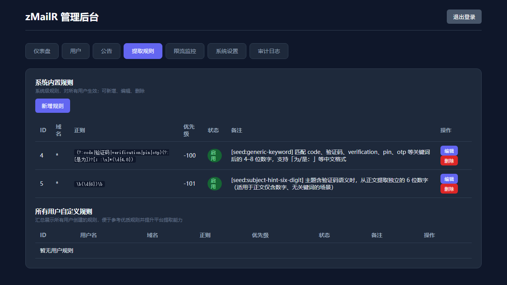

全局内置规则与所有用户自定义规则汇总。

#### 限流监控

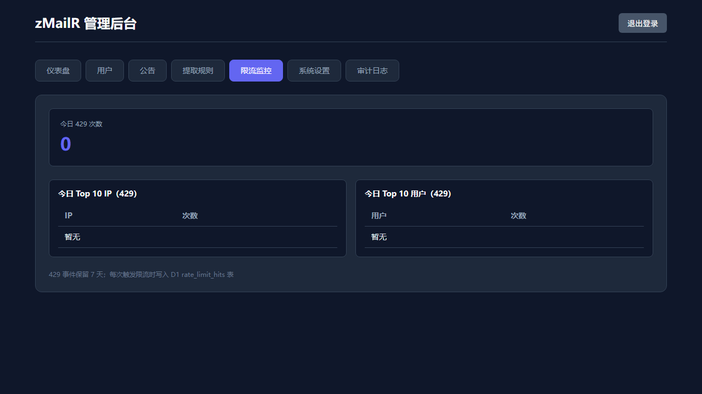

今日 429 次数、Top IP / Top 用户排行。

#### 系统设置

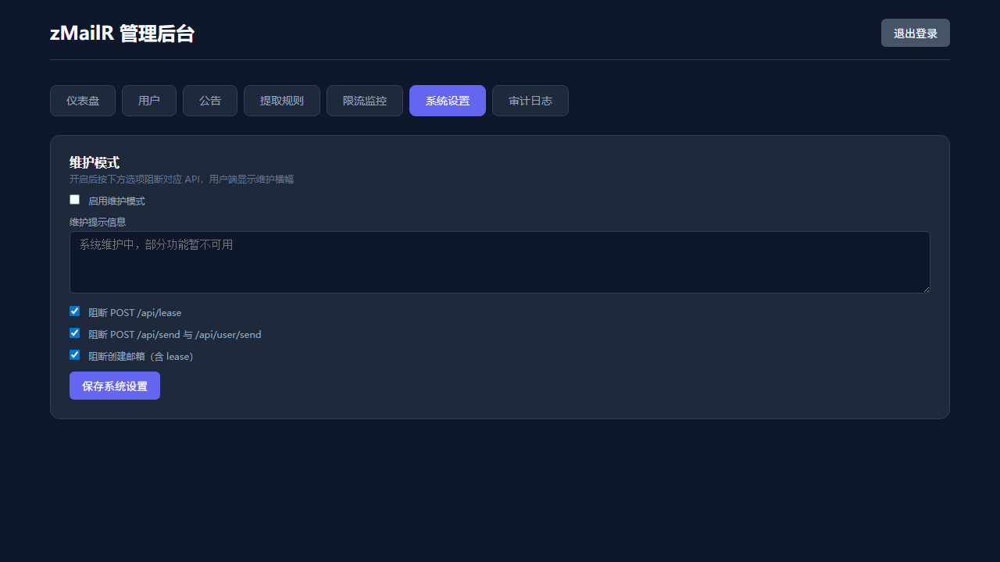

维护模式：可选阻断 lease、发信、创建邮箱等 API。

#### 审计日志

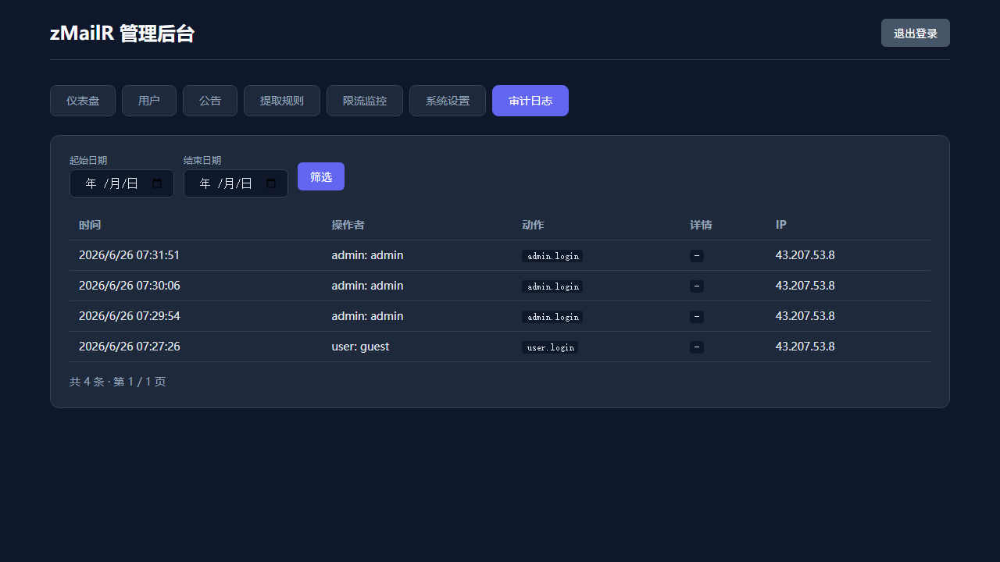

管理员与用户关键操作记录，按日期筛选。

---

## 使用指南（简要）

1. 访问演示站或自托管实例，使用账号登录（演示：`guest` / `guest`）。
2. 在 **仪表板** 查看配额；若无 API Token，在 **API 密钥** 创建（明文仅显示一次）。
3. 在 **收件箱** 点击「新建收件箱」生成临时地址，等待收信或配合外部发信测试。
4. 在 **发件箱** 发送测试邮件（需配置 Brevo，见 [brevo-setup.md](docs/brevo-setup.md)）。
5. 使用 **API 调试** 或 curl 调用程序化接口；完整流程可用 `scripts/verify_api.py` 验证。

---

## 文档导航

| 文档 | 说明 |
|------|------|
| [docs/deploy.md](docs/deploy.md) | **部署指南**（D1、GitHub Secrets、Email Routing、本地开发） |
| [docs/admin-guide.md](docs/admin-guide.md) | 管理后台（`ADMIN_PATH`、用户、维护模式、审计日志） |
| [docs/brevo-setup.md](docs/brevo-setup.md) | Brevo 出站发信与 DNS（SPF/DKIM/DMARC） |
| [docs/user-auth.md](docs/user-auth.md) | 用户认证、API Token scope、per-user 速率限制 |
| [docs/mailsink-comparison.md](docs/mailsink-comparison.md) | 与 MailSink 功能对照与端点映射 |
| [README.en.md](README.en.md) | English README |

---

## Star History

[](https://star-history.com/#jia0327/zmailr&Date)

---

## 贡献与 Git 配置

为避免 Cursor Agent 自动写入 co-author 信息，建议每位贡献者做一次本地配置：

1. **启用仓库 Git hooks**（一次性）：

   ```bash
   git config core.hooksPath .githooks
   ```

   仓库已提供 `.githooks/commit-msg`，会在提交前移除 `cursoragent@cursor.com`、`Co-authored-by: … Cursor`、`Made-with: … Cursor` 等行。

2. **关闭 Cursor 提交署名**：Cursor Settings → **Agents** → **Attribution** → 关闭 **Commit Attribution**。

---

## 许可证

[MIT License](./LICENSE)
