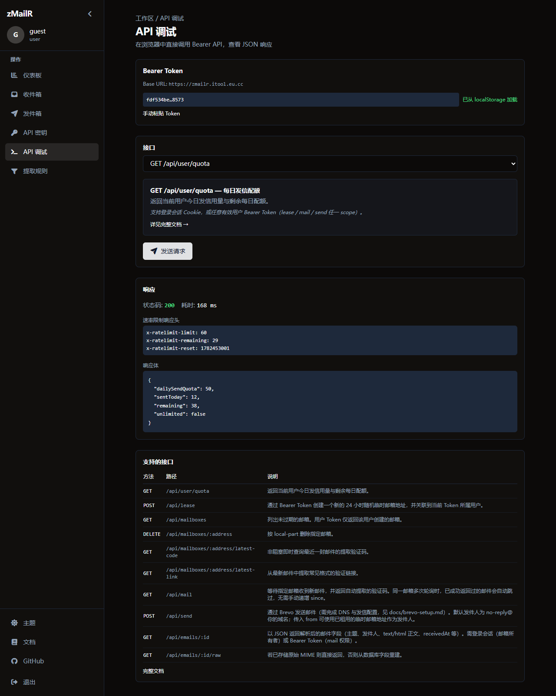

# MCP 快速接入

> [创建 API 密钥](./create-api-key.md) · [MCP 工具参考](./mcp-tools.md) · [产品概述](./overview.md)

**`@zmailr/mcp`** 把 REST API 封装成 MCP 工具，供 **Cursor、Claude Desktop** 等 Agent 直接调用——无需在对话里手写 curl。

## 前提条件

- 已创建 Bearer Token（`lease` + `mail`）→ [创建 API 密钥](./create-api-key.md)
- 已安装 Node.js（用于 `npx`）或本地构建 monorepo 包

预计耗时：**约 5 分钟**

---

## 步骤 1：准备 Token

1. <SiteLink to="/login">登录</SiteLink> → <SiteLink to="/dashboard/api-keys">API 密钥</SiteLink>
2. 新建 Token，Scope 勾选 **`lease`** + **`mail`**（发信再加 **`send`**）
3. 复制 `ZMAILR_TOKEN`

Scope 说明 → [认证说明](./user-auth.md#token-scope)

---

## 步骤 2：配置 MCP

### Cursor

在 `.cursor/mcp.json` 或 **Settings → MCP** 中添加：

```json
{
  "mcpServers": {
    "zmailr": {
      "command": "npx",
      "args": ["-y", "@zmailr/mcp"],
      "env": {
        "ZMAILR_BASE_URL": "https://your-domain",
        "ZMAILR_TOKEN": "your-bearer-token"
      }
    }
  }
}
```

| 变量 | 值 |
|------|-----|
| `ZMAILR_BASE_URL` | <SiteOrigin />（无尾部 `/`） |
| `ZMAILR_TOKEN` | 上一步复制的 Bearer Token |

可复制 [mcp.json.example](./mcp.json.example) 到 `.cursor/mcp.json`（已 gitignore）。

### Claude Desktop

| 平台 | 配置文件 |
|------|----------|
| **Windows** | `%APPDATA%\Claude\claude_desktop_config.json` |
| **macOS** | `~/Library/Application Support/Claude/claude_desktop_config.json` |

JSON 结构与 Cursor 相同。修改后 **重启 Cursor / Claude Desktop**。

---

## 步骤 3：验证 {#验证}

在对话中输入：

> 用 zmailr 调用 `lease_mailbox` 租一个临时邮箱，把完整地址发给我。

若返回 JSON 含 `email` 字段，说明 MCP 已连通。

也可在 Dashboard **API 调试** 页对照 REST 行为（MCP 底层调用相同接口）：



---
## MCP 还是 REST？

| 方式 | 适合 | 说明 |
|------|------|------|
| **MCP** | Cursor / Claude、自然语言驱动 | Agent 选工具；底层仍调 REST |
| **REST / 脚本** | CI、Python/Node、精确控制 | [第一个脚本](./first-script.md) · [脚本接入](./scripting.md) |

两者共用同一 Token 与 Base URL，**无额外 MCP 端点**。

---

## 典型 Agent 工作流

MCP **没有**「写提取规则」工具。新站点须 **先在控制台验证收码、配好规则**，再交给 Agent 全自动跑通。完整路径 → [验证码完整流程](./otp-workflow.md)

### 阶段一：控制台验证（自动化前）

1. **租用邮箱** — 控制台 **新建邮箱** 或 Agent 调 **`lease_mailbox`**
2. **触发验证** — 在目标网站填写该邮箱，等待验证邮件
3. **确认能提取 OTP** — 打开 <SiteLink to="/dashboard/inbox">收件箱</SiteLink>：
   - OTP **已高亮** → 默认或已有规则可用，可进入阶段二
   - **有信无码**（列表有信但无 OTP 徽章，或 API 返回 `404 no_code`）→ 按 [自定义提取规则](./extract-rules.md) 配置正则，**重新提取** 或让站点重发验证邮件，直至控制台能稳定看到 OTP

::: tip 为何先走控制台？
`wait_for_mail` 在 `require_code=true` 时只返回 **已提取 OTP** 的邮件。规则未匹配时，即使收件箱已有信，Agent 也会一直等到 `408 timeout`。
:::

### 阶段二：Agent 自动化

规则稳定后，Agent 可重复执行：

1. **`lease_mailbox`** — 获取 `email`（24h 有效）
2. 用户在目标网站使用该邮箱注册（或 Agent 通过浏览器工具填写）
3. **`wait_for_mail`**（阻塞等 OTP）或 **`get_latest_code`**（即时查询）
4. 可选：**`get_latest_link`** 取验证链接；**`send_email`** 测出站发信

对话示例：

- 「租临时邮箱并完成某站注册，把 OTP 告诉我」
- 「用 `wait_for_mail` 等 60 秒看有没有验证码」
- 「列出我当前所有邮箱」→ `list_mailboxes`

11 个工具参数 → [MCP 工具参考](./mcp-tools.md)

---

## 常见错误 {#常见错误}

MCP 工具失败时返回 `isError: true`，文本含 HTTP 状态与 body。

| 现象 | 原因 | 处理 |
|------|------|------|
| `401` / 未授权 | Token 无效 | 重建 Token，检查 `ZMAILR_TOKEN` |
| `403` / 缺少 mail 权限 | Scope 不够 | Token 勾选 `mail` |
| `404` / `no_email` | 邮件未到 | 改用 `wait_for_mail` 或稍后重试 |
| `404` / `no_code` | 有信但未提取 OTP（有信无码） | 先在控制台配 [提取规则](./extract-rules.md)，再重试 |
| `408` / `timeout` | 长轮询超时 | 增大 `wait_for_mail` 的 `timeout` |
| `429` / `rate_limit` | 请求过快 | 降频，读 `Retry-After` |

完整错误表 → [错误码与限流](./errors.md)

---

## 本地 monorepo 开发

```bash
pnpm --filter @zmailr/mcp run build
```

```json
{
  "mcpServers": {
    "zmailr": {
      "command": "node",
      "args": ["packages/mcp/dist/index.js"],
      "env": {
        "ZMAILR_BASE_URL": "http://localhost:8787",
        "ZMAILR_TOKEN": "your-token"
      }
    }
  }
}
```

---

## 安装

```bash
npx -y @zmailr/mcp
```

npm 包：[`@zmailr/mcp`](https://www.npmjs.com/package/@zmailr/mcp)

---

## 下一步

| 目标 | 文档 |
|------|------|
| 11 个工具参数表 | [MCP 工具参考](./mcp-tools.md) |
| REST 端点详情 | [API 参考](./api.md) |
| 不用 MCP 写脚本 | [第一个脚本](./first-script.md) |
